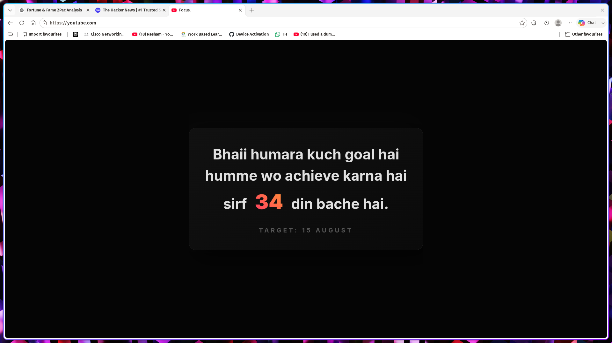

# UltraFocus

UltraFocus is a system-level distraction blocker and motivational redirect server for Linux. It aggressively blocks popular social media, news, shopping, and OTT platforms, and seamlessly intercepts those network requests to redirect you to a custom motivational countdown page.



## Overview

The system locks down your machine using three main components:
1. **Host-level DNS null routing**: All blocked domains in `/etc/hosts` are securely pointed to `127.0.0.1`.
2. **Local Intercept Server**: A lightweight Python `http.server` running completely locally on ports 80 (HTTP) and 443 (HTTPS) to catch the blocked traffic.
3. **Automated SSL Trust**: Custom self-signed SSL certificates for all 60+ blocked domains injected directly into the Chrome/Linux `nssdb` trust store so the motivational page loads immediately without throwing privacy errors.

---

## Installation

UltraFocus is designed to be plug-and-play for any Linux distribution (Ubuntu, Debian, Arch, Garuda, Fedora, etc.).

1. Clone the repository anywhere on your machine:
   ```bash
   git clone https://github.com/udayydogra/ultrafocus.git
   cd ultrafocus
   ```
2. Run the distraction blocker script (adds domains to `/etc/hosts` and configures `iptables` for system-wide blocking):
   ```bash
   sudo bash distraction_free.sh
   ```
3. Set up the local Python intercept server (registers a system service that runs automatically in the background on startup):
   ```bash
   sudo bash setup_server.sh
   ```
4. Fix the HTTPS/SSL certificate errors for Chrome/Brave/Edge so the block page shows up cleanly without privacy warnings:
   ```bash
   sudo bash fix_cert.sh
   ```

---

## How to Change the Target Date

By default, the countdown target date is set to **15 August**. When you successfully hit this goal and need to set a new one, you can easily change the date by following these steps:

1. Open the `index.html` file in your favorite text editor from inside the cloned project directory:
   ```bash
   nano index.html
   ```

2. Scroll down to the `<script>` section at the bottom of the file and locate this specific line of code:
   ```javascript
   let targetDate = new Date(today.getFullYear(), 7, 15); // Month is 0-indexed (7 = August)
   ```

3. Change the month and day numbers to your new goal. 
   **Crucial Note: Months in JavaScript are 0-indexed!**
   - January = `0`
   - February = `1`
   - ...
   - August = `7`
   - December = `11`
   
   *Example: To change the target to December 31st, update the line to look like this:*
   ```javascript
   let targetDate = new Date(today.getFullYear(), 11, 31);
   ```

4. If you also want to change the "Target: 15 August" text displayed on the screen, scroll up slightly to line `73` and update the HTML text directly:
   ```html
   <div class="subtext">Target: 31 December</div>
   ```

5. Save the file. The changes will immediately take effect the next time the page is loaded! You do **not** need to restart the server.
